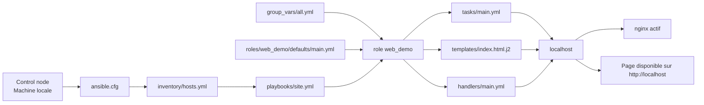

# Ansible Demo Lab

Projet de prise en main d'Ansible pour apprendre les bases de l'automatisation sur un cas simple, lisible et rejouable.

Ce dépôt configure une machine Debian ou Ubuntu locale avec Ansible pour :

- installer `nginx`, `curl` et `git`
- déployer une page HTML générée depuis un template Jinja2
- activer et démarrer le service `nginx`

L'approche suit les principes mis en avant dans la documentation officielle d'Ansible : automatisation lisible, architecture agentless, usage de YAML, et idempotence.

## Sommaire

- [Objectif](#objectif)
- [Fonctionnement](#fonctionnement)
- [Architecture](#architecture)
- [Arborescence](#arborescence)
- [Prérequis](#prérequis)
- [Démarrage rapide](#démarrage-rapide)
- [Variables](#variables)
- [Vérification](#vérification)
- [Documentation](#documentation)
- [Ressources officielles](#ressources-officielles)

## Objectif

Ce dépôt sert de laboratoire d'apprentissage pour manipuler les concepts essentiels d'Ansible :

- inventaire
- playbook
- rôle
- variables globales
- valeurs par défaut
- template Jinja2
- handler
- idempotence

Le scénario est volontairement simple : un seul hôte cible, `localhost`, afin de se concentrer sur la structure du projet et sur le cycle d'exécution d'Ansible.

## Fonctionnement

Le point d'entrée est [playbooks/site.yml](/root/Ansible/playbooks/site.yml:1), qui cible le groupe `local` défini dans [inventory/hosts.yml](/root/Ansible/inventory/hosts.yml:1) et applique le rôle `web_demo`.

Ce rôle :

- vérifie que le système appartient à la famille Debian
- met à jour le cache `apt`
- installe les paquets définis dans [group_vars/all.yml](/root/Ansible/group_vars/all.yml:1)
- déploie `/var/www/html/index.html` depuis [roles/web_demo/templates/index.html.j2](/root/Ansible/roles/web_demo/templates/index.html.j2:1)
- redémarre `nginx` uniquement si le template change

Le projet illustre ainsi un comportement idempotent : lorsque l'état cible est déjà atteint, une nouvelle exécution ne doit pas appliquer de changements inutiles.

## Architecture



Lecture rapide du flux :

1. Ansible charge la configuration dans [ansible.cfg](/root/Ansible/ansible.cfg:1).
2. L'inventaire déclare `localhost` comme cible locale.
3. Le playbook appelle le rôle `web_demo`.
4. Le rôle consomme ses variables et applique ses tâches.
5. `nginx` sert la page générée à partir du template.

## Arborescence

```text
.
├── ansible.cfg
├── docs/
│   ├── architecture.md
│   └── guide-demarrage.md
├── group_vars/
│   └── all.yml
├── inventory/
│   └── hosts.yml
├── playbooks/
│   └── site.yml
└── roles/
    └── web_demo/
        ├── defaults/
        │   └── main.yml
        ├── handlers/
        │   └── main.yml
        ├── tasks/
        │   └── main.yml
        └── templates/
            └── index.html.j2
```

## Prérequis

- Debian ou Ubuntu
- `ansible` installé sur la machine de contrôle
- `sudo` disponible
- accès local à `localhost`

Installation typique :

```bash
sudo apt update
sudo apt install -y ansible
```

Vérification :

```bash
ansible --version
ansible-playbook --version
```

## Démarrage rapide

Depuis la racine du dépôt :

```bash
ansible-playbook playbooks/site.yml
```

Avec une simulation sans appliquer les changements :

```bash
ansible-playbook playbooks/site.yml --check --diff
```

Comme [ansible.cfg](/root/Ansible/ansible.cfg:1) active déjà `become = True`, il n'est pas nécessaire de le répéter dans la commande. Si votre configuration `sudo` locale le demande, exécutez la commande depuis un shell autorisé ou adaptez votre environnement.

## Variables

Les principales variables modifiables sont dans [group_vars/all.yml](/root/Ansible/group_vars/all.yml:1) :

- `demo_site_title`
- `demo_site_message`
- `demo_owner`
- `web_demo_packages`

Les valeurs par défaut propres au rôle sont dans [roles/web_demo/defaults/main.yml](/root/Ansible/roles/web_demo/defaults/main.yml:1) :

- `web_demo_site_path`
- `web_demo_service_name`

## Vérification

Quelques commandes utiles après exécution :

```bash
ansible-inventory --graph
curl http://localhost
systemctl status nginx
```

Résultat attendu :

- `nginx` est installé
- le service est démarré et activé
- la page web reflète les variables définies dans `group_vars/all.yml`

## Documentation

- [Guide de démarrage](/root/Ansible/docs/guide-demarrage.md:1)
- [Architecture du projet](/root/Ansible/docs/architecture.md:1)

## Ressources officielles

Les améliorations de ce `README` s'appuient sur le ton et les principes exposés dans la documentation officielle d'Ansible :

- Ansible community documentation: https://docs.ansible.com/
- Introduction to Ansible: https://docs.ansible.com/projects/ansible/latest/getting_started/introduction.html
- Roles in Ansible playbooks: https://docs.ansible.com/projects/ansible/latest/playbook_guide/playbooks_reuse_roles.html
- Official `ansible/ansible` repository: https://github.com/ansible/ansible
